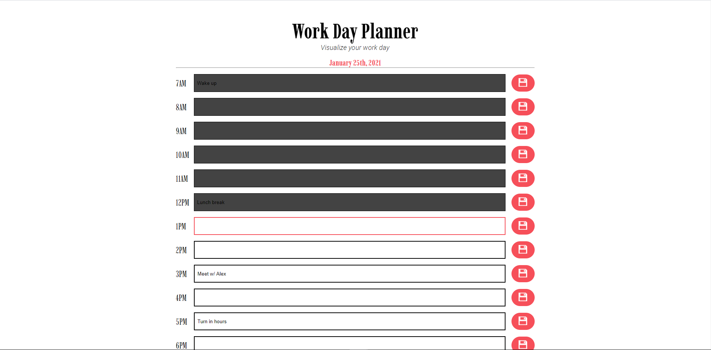

# hw-week-five

This project is a simple day planner utilizing basic front-end technologies (HTML, CSS, SCSS, JS) in junction with the Moment.js library. This planner application acts as a way for users to input events throughout their day into inputs organized by hour. Users have the option to save their events to local storage so their events will not be erased if the user refreshes the page. This application uses JavaScript to dynamically update the page with the current date, as well as update the hourly inputs to match the time of day. The purpose of this project was to gain familiarity with various aspecs of JavaScript, generate a useful application, and work with JS libraries.

Live deployment of this project can be viewed at: https://jaymanw.github.io/hw-week-five/